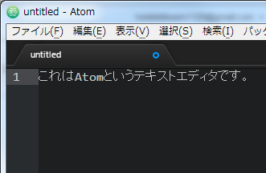
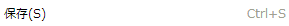
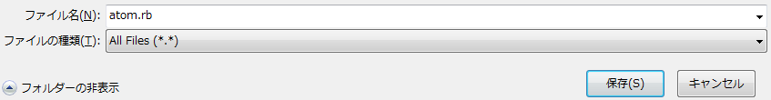

#２．はじめてのプログラミング

ここではパソコン上でプログラミングをおこなうために必要な操作について説明していきます。

## キーボード
プログラミングではキーボードでさまざまな文字を入力します。
それぞれの文字の入力方法について説明します。

* 全角・半角入力を切り替えます
 

* カーソルの前の文字を削除します
 

* カーソルの後の文字を削除します
 

* テキストエディタ内で改行します
 

* 記号を入力します

    |記号|読み方|キーボード|
    |:----:|----------------|----------------------------------------------------------------|
    |"     |ダブルクォーテーション  | + 
    |'     |シングルクォーテーション | + 
    |\#    |シャープ           | + 
    |=     |イコール           | + 
    |\+    |プラス            | +  又は 
    |\-    |マイナス、ハイフン     | 又は 
    |\*    |アスタリスク、かける    | +  又は 
    |/     |スラッシュ、割る      | 又は 
    |%     |パーセント          | + 
    |^     |キャレット、やまがた    |
    |&     |アンド             | + 
    |&#124;|縦線、バーティカルバー | + 
    |<     |不等号（～より小さい） | + 
    |\>    |不等号（～より大きい） | + 
    |(     |かっこ（はじめ）       | + 
    |)     |かっこ（おわり）       | + 
    |&#91; |大かっこ（はじめ）     |
    |&#93; |大かっこ（おわり）     |
    |{     |中かっこ（はじめ）     | + 
    |,     |カンマ、コンマ        |
    |.     |ピリオド、ドット       |
    |}     |中かっこ（おわり）     | + 
    |;     |セミコロン          |
    |:     |コロン            |
    |_     |アンダーバー        | + 
    |!     |ビックリマーク        | + 
    |?     |はてなマーク        | + 
    |@     |アットマーク         |
    |\     |バックスラッシュ、円マーク| 又は 
    |$     |ドル              | + 


## エディタ
パソコン上で文字のみのファイル（テキストファイル）を作成、編集、保存するためのソフトウェアのことです。
一般的に、文字（テキスト）の入力、削除、コピー、貼り付け、検索、置換、整形などの機能を備えています。
今回は「Atom」というテキストエディタを使ってプログラムを作成します。

### エディタの起動
1. 「スタート」をクリックします
 

2. 「コンピューター」をダブルクリックします

3. 「リムーバブル ディスク」をダブルクリックします

4. 「Atom」フォルダをダブルクリックします

5. 「atom.exe」をダブルクリックすると、テキストエディタ「Atom」が起動します


### テキストファイルの保存
エディタで何か文字を入力した場合は、ファイルとして保存する必要があります。
保存は以下の方法でおこないます。

1.  何か文字を入力します
 

2. 「ファイル」メニューをクリックします
 

3. 「保存」メニューをクリックします
 

4. 「ファイル名」を入力して「保存」をクリックします
 

5. エクスプローラーで保存されたファイルを確認することができます


## コマンドプロンプト
コンピュータに直接命令を出すことができるソフトウェアのことです。
コンピュータに出す命令のことを「コマンド」と呼びます。

### コマンドプロンプトの使い方
1. 「スタート」をクリックします
 

2. 「コンピューター」をダブルクリックします

3. 「リムーバブル ディスク」をダブルクリックします

4. 「cmd.bat」をダブルクリックすると、コマンドプロンプトが起動します

5. 以下のようにコマンドを入力し、エンターキーを押すとコマンドが実行されます（「help」コマンドは、一般的なコマンドの一覧を表示するコマンドです）
```
help
```


## 最初のプログラム「Hello World」
エディタとコマンドプロンプトを使って最初のプログラムを書いて実行してみよう。

1. エディタを開きます

2. 以下のようにエディタに入力します
```ruby
puts "Hello World"
```

3. 『hello.rb』というファイル名でファイルを保存します

4. コマンドプロンプトを立ち上げます

5. 以下のようにコマンドを入力し、エンターキーを押してコマンドを実行します
```
ruby hello.rb
```

6. コマンドプロンプトに以下のように表示されているか確認しましょう
```
Hello World
```
 表示されなかったら近くの先生に声をかけてね。
 
