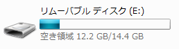
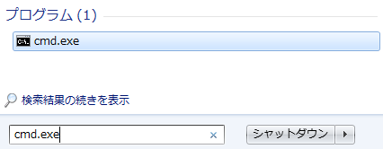

#２．はじめてのプログラミング

# パソコンの使い方
## キーボード
* 全角・半角入力の切り替え  
全角入力と半角入力を切り替える事ができます。

* 文字を消す  
カーソルの前の文字を削除します。  
カーソルの後の文字を削除します。  

* 記号を入力する  
 + 


## マウス
## ファイル


# 環境構築
プログラミングをおこなうには、自分のパソコンに道具を揃える必要があります。一つ一つの道具を揃える作業をインストールといい、全体で環境構築と呼びます。

## Ruby
作成したプログラムを解釈する

### Rubyのインストール


## エディタ
パソコン上で文字（テキスト）のみのファイル、すなわちテキストファイルを作成、編集、保存するためのソフトウェアのことです。一般的に、文字（テキスト）の入力、削除、コピー、貼り付け、検索、置換、整形などの機能を備えています。
今回は「Atom」というエディタを使ってプログラムを作成します。

### エディタのインストール

### エディタの起動
1. 「スタート」をクリックします。

2. 「コンピューター」をクリックします。

3. 「リムーバブル ディスク」をクリックします。

4. 「Atom」フォルダをクリックします。

5. 「atom」をクリックすると、テキストエディタ「Atom」が起動します。


### エディタの使い方
1. 何か文字を入力します


2. 「ファイル」をクリック

3. 「保存」をクリック

4. 「ファイル名」を入力して「保存」をクリックします


5. エクスプローラーで保存されたファイルを確認することができます。

## コマンドプロンプト
コンピューターに直接命令を出すことができるソフトウェアの事です
コンピューターに出す命令の事を「コマンド」と言います
### コマンドプロンプトの使い方
1. 「スタート」をクリックする

2. 「cmd.exe」と入力して、「プログラム」の下に出てきた「cmd.exe」をクリックする


3. コマンドを実行する
```help```
と入力する
「help」コマンドは、一般的なコマンドの一覧を表示するコマンドです


# 最初のプログラム「Hello World」

1. エディタを開く

2. 以下のように入力する
```puts “Hello World”```

3. ファイルを保存する（hello.rb）

4. コマンドを立ち上げる

5. 以下のように入力する
```ruby hello.rb```

6. 「Hello World」と表示されたらOK
表示されなかったら近くの先生に声をかけてね

