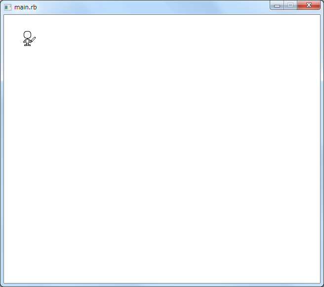
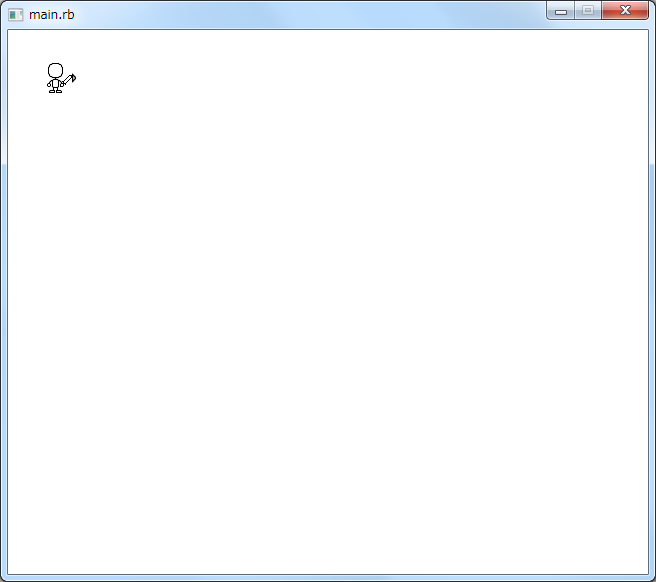
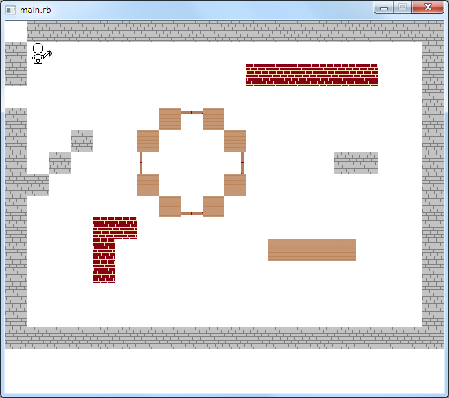
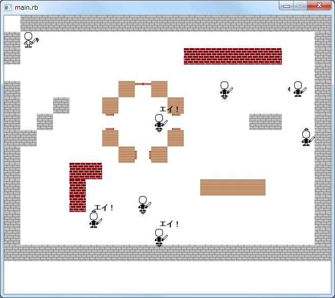
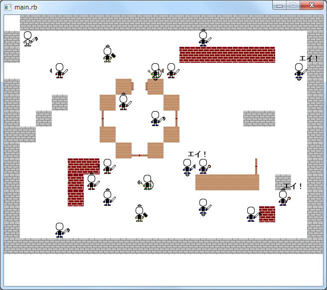

# ４．ゲームを作ろう

## ゲームの作り方

ゲームをはじめとしたソフトウェアを開発するには、まず『設計』という作業をします。
いきなりプログラムを書き始めるのではなく、どのようなソフトウェアを作りたいのか、最初に考えることはとても重要です。

* 作りたいゲームをイメージしてみよう
* イメージしたものを紙に描いてみよう
* キャラクターをデザインしよう
* 背景をデザインしよう
* キャラクターの動きを決めよう
* キーボードやマウスを使ったキャラクターの動かし方を決めよう
* プログラムの構成を考えよう

### 今回のゲーム


* 登場人物
- 主人公
-  敵


### プログラムの作成

設計ができたら、実際にプログラムを作成していきます。
ソフトウェアはプログラムが書かれたいくつものファイルによって構成されています。

1. エクスプローラで確認してみよう。

2. エディタで『main.rb』を開いてみよう。プログラムが書かれていることがわかります。

3. プログラムは **半角英数字と記号** で書きます。全角と半角に気をつけよう。また、大文字、小文字も区別するので注意しよう。

4. 何かプログラムを書いたら、必ず保存を実行しよう。また、ファイル名には半角英数字を使うことに気をつけよう。


### ソフトウェアの実行

作成したソフトウェアを実行するには、コマンドプロンプトを使います。エクスプローラでダブルクリックするのではありません。
コマンドプロンプトを開いて、以下の文字列（コマンドと呼びます）を入力しエンターキーを押すと、プログラムの実行がはじまります。

```
ruby main.rb
```

最初は何も反応がありませんが、プログラムを徐々に作成していくとゲームとして動くようになります。

---


## ゲームの作成

今まで学んだ知識を使いながら、実際にゲームを作っていきます。

### ステップ1.ウィンドウとプレーヤー

最初は、ゲームのベースとなるウィンドウと主人公を表示してみましょう。

#### main.rb
『main.rb』をエディタで開いて、以下のようにプログラムを追加してみてください。
プログラムを入力したら、忘れずに保存しよう。

```{.ruby .numberLines startFrom="1"}
require_relative  "./bomber"

Window.height += 64

player = Bomber::Player.new(1, 1, 0)

player.on(:start) do
end
```

#### bomber/player.rb
エディタで新規作成を選択して、新しいファイルを作ります。
以下のようにプログラムを入力し、bomberディレクトリに『player.rb』として保存します。

```{.ruby .numberLines startFrom="1"}
module Bomber
  class Player < Bomber::Character
    attr_accessor :guide, :agl
    def initialize(x, y, angle)
      super(costume_lists, x, y, angle)
      @agl = :right
    end

    def costume_lists
      ["../image/hito.png"]
    end

    def move(move_angle=:right)
      if self.agl == move_angle
        self.send("move_#{move_angle.to_s}".to_sym)
        sleep 0.1
      end
      angle_shift(move_angle)
    end

    def lose
      super
      sleep 3
      exit
    end
  end
end
```

プログラムを保存したら、コマンドプロンプトを開いて、以下のコマンドを入力し、エンターキーを押してみましょう。

```
ruby main.rb
```

以下のようなウィンドウが開けば、ステップ1は終了です。



ウィンドウが開かない場合はプログラムが間違っているので見直しましょう。
コマンドプロンプトにエラーが出ているかもしれないので、確認してみましょう。


### ステップ2.主人公を動かす

次は、主人公をキーボードを使って動かしてみましょう。
また、主人公が向いている方向を示すガイド機能も作りましょう。

#### bomber/guide.rb
まず、主人公が向いている方向を示すガイド機能を作ります。
エディタで新規作成を選択して、新しいファイルを作ります。
以下のようにプログラムを入力し、bomberディレクトリに『guide.rb』として保存します。

```{.ruby .numberLines startFrom="1"}
module Bomber
  class Guide < Bomber::Character
    def initialize(target)
      @target = target
      super(costume_lists, @target.x, @target.y, 0)
    end

    def costume_lists
      ["../image/up.png",
       "../image/down.png",
       "../image/left.png",
       "../image/right.png"]
    end

    def trace
      agl = @target.agl
      self.x, self.y = @target.x, @target.y
      case agl
      when :up
        self.y -= 4
        self.image = @costumes[0]
      when :down
        self.y += 32
        self.image = @costumes[1]
      when :left
        self.x -= 4
        self.image = @costumes[2]
      when :right
        self.x += 32
        self.image = @costumes[3]
      end
    end
  end
end
```

ここで、
```ruby
    def costume_lists
      ["../image/up.png",
       "../image/down.png",
       "../image/left.png",
       "../image/right.png"]
    end
```
は、ガイドに使用する画像を指定しています。

```ruby
      case agl
      when :up
        self.y -= 4
        self.image = @costumes[0]
```
は、主人公の位置からみて、どの位置にガイドを表示するかを指定しています。xやyは座標です。


#### bomber/player.rb
上記で作成したガイドを主人公のまわりに表示されるようにします。
キーボードが押されたら、押された方向に合わせてガイドが表示されるようにします。
以下となるように、『player.rb』にプログラムを追加します。

```{.ruby .numberLines startFrom="6"}
      @agl = :right
      @guide = Bomber::Guide.new(self)
      @guide.trace
    end
```

#### main.rb
最後に、キーボードが押されたときにキャラクターを動かす処理を追加します。
『main.rb』をエディタで開いて、以下となるようにプログラムを変更してください。

```{.ruby .numberLines startFrom="1"}
require_relative  "./bomber"

Window.height += 64

$all_obj = Array.new
$hit_obj = Array.new

player = Bomber::Player.new(1, 1, 0)
$all_obj << player
$all_obj.flatten!

$hit_obj << player
$hit_obj.flatten!

player.on(:start) do
  on(:key_down, K_RIGHT) do
    self.move(:right)
  end

  on(:key_down, K_LEFT) do
    self.move(:left)
  end

  on(:key_down, K_UP) do
    self.move(:up)
  end

  on(:key_down, K_DOWN) do
    self.move(:down)
  end

end
```

ここで、
```ruby
  on(:key_down, K_RIGHT) do
    self.move(:right)
  end
```
は、キーボードの「→」が押されたとき、主人公を右に動かすという処理です。

プログラムを保存したら、コマンドプロンプトを開いて、以下のコマンドを入力し、エンターキーを押してみましょう。

```
ruby main.rb
```

以下のようなウィンドウが開き、キーボードで主人公が動くことを確認できたら、ステップ2は終了です。



ウィンドウが開かない、主人公が動かないなどは、プログラムが間違っているので見直しましょう。
コマンドプロンプトにエラーが出ているかもしれないので、確認してみましょう。


### ステップ3.ブロックを配置する

次は、殺風景なウィンドウにブロックを配置してみましょう。

#### bomber/block.rb
まず、ブロックを表現するオブジェクトを作ります。
エディタで新規作成を選択して、新しいファイルを作ります。
以下のようにプログラムを入力し、bomberディレクトリに『block.rb』として保存します。
長いので、間違えないように注意して入力しよう。

```{.ruby .numberLines startFrom="1"}
module Bomber
  class Block < Bomber::Character
    attr_accessor :col
    def initialize(data)
      if data.class == Hash
        @col = data['col']
        super("../image/block_#{data['col']}.png", data["x"].to_i, data["y"].to_i, 0)
      elsif data.class == Array
        super(costume_lists, data[0], data[1], 0)
      end
      self.z = 0
    end

    def destroy
      return if self.wall?
      $hit_obj -= [self]
      $all_obj -= [self]
      fire = Bomber::Fire.new(*self.current_block)
      self.vanish
      sleep 0.1
      fire.vanish
    end

    def wall?
      self.current_y_block == 0 or self.current_y_block == HEIGHT or self.current_x_block == 0 or self.current_x_block == WIDTH
    end

    def costume_lists
      ["../image/block_stone.png",
       "../image/block_brick.png",
       "../image/block_wood.png"]
    end

    def collar_lists
      ["stone", "brick", "wood"]
    end

    def add_event
      if Input.mouse_push?(M_LBUTTON)
        $blocks -= [self]
        self.vanish
      elsif Input.mouse_push?(M_RBUTTON)
        next_costume
        puts self.image.inspect
      else
      end
    end
  end
end
```

#### bomber/door.rb
ブロックだけでなく、主人公が開けることができるドアオブジェクトも作りましょう。
エディタで新規作成を選択して、新しいファイルを作ります。
以下のようにプログラムを入力し、bomberディレクトリに『door.rb』として保存します。

```{.ruby .numberLines startFrom="1"}
module Bomber
  class Door < Bomber::Character
    attr_accessor :close
    def initialize(*data)
      @close = true
      super(costume_lists(data[2]), data[0].to_i, data[1].to_i, 0)
      self.z = 0
    end

    def costume_lists(data=:up)
      ["../image/door_#{data.to_s}_close.png",
       "../image/door_#{data.to_s}_open.png"]
    end

    def lose
      next_costume
      @close = !@close
      if @close
        $hit_obj << self
      else
        $hit_obj -= [self]
      end
    end

    def destroy
      return if self.current_y_block == 0 or self.current_y_block == HEIGHT or self.current_x_block == 0 or self.current_x_block == WIDTH
      $hit_obj -= [self]
      $all_obj -= [self]
      fire = Bomber::Fire.new(*self.current_block)
      self.vanish
      sleep 0.1
      fire.vanish
    end
  end
end
```

#### main.rb
最後に、ウィンドウにブロックとドアを配置する処理を追加します。
『main.rb』をエディタで開いて、以下となるようにプログラムを変更してください。

```{.ruby .numberLines startFrom="1"}
require_relative  "./bomber"

Window.height += 64

$all_obj = Array.new
$hit_obj = Array.new

$blocks = Array.new
datas = YAML.load_file(File.expand_path("../config.yml", __FILE__))
datas.each do |data|
  $blocks << block =  Bomber::Block.new(data)
end

doors = Array.new
doors << door1 = Bomber::Door.new( 8,  4, :up)
doors << door2 = Bomber::Door.new( 6,  6, :left)
doors << door3 = Bomber::Door.new(10,  6, :right)
doors << door4 = Bomber::Door.new( 8,  8, :down)

player = Bomber::Player.new(1, 1, 0)
$all_obj << player
$all_obj << $blocks
$all_obj << doors
$all_obj.flatten!

$hit_obj << $blocks
$hit_obj << doors
$hit_obj << player
$hit_obj.flatten!
```

プログラムを保存したら、コマンドプロンプトを開いて、以下のコマンドを入力し、エンターキーを押してみましょう。

```
ruby main.rb
```

以下のようなウィンドウが開けば、ステップ3は終了です。
念のため、主人公がキーボードで操作できるかも確認してみましょう。



ウィンドウが開かない場合はプログラムが間違っているので見直しましょう。
コマンドプロンプトにエラーが出ているかもしれないので、確認してみましょう。


## Step4.敵

### bomber/enemy_normal.rb

```
module Bomber
  class EnemyNormal < Bomber::Character
    attr_accessor :guide, :agl
    def initialize(x, y, angle, delay=0)
      super(costume_lists, x, y, angle)
      @agl = :right
      @delay = delay
      @guide = Bomber::Guide.new(self)
      @guide.trace
    end

    def costume_lists
      ["../image/ene.png"]
    end

    def action_list
      [:up, :down, :right, :left]
    end

    def auto
      super
      random_move
    end

    def random_move
      num = rand(4)
      sleep @delay
      sleep 0.3
      self.send("move_#{action_list[num].to_s}".to_sym)
      sleep 0.2
      self.send("move_#{action_list[num].to_s}".to_sym)
      reject_half
    end
  end
end
```

### main.rb 22-26
```

$enemy = Array.new
$enemy << Bomber::EnemyNormal.new( 1, 13, 0, 0.3)
$enemy << Bomber::EnemyNormal.new( 5, 12, 0, 0.4)
$enemy << Bomber::EnemyNormal.new( 8,  7, 0,   0)
$enemy << Bomber::EnemyNormal.new(10,  8, 0, 0.2)
$enemy << Bomber::EnemyNormal.new(12,  1, 0, 0.1)
$enemy << Bomber::EnemyNormal.new(13, 13, 0, 0.1)
$enemy << Bomber::EnemyNormal.new(15, 11, 0, 0.2)
$enemy << Bomber::EnemyNormal.new(18,  1, 0,   0)

$enemy.each do |ene|
  ene.on(:start) do
    while self.active do
      if self.active
        self.auto
      end
    end
  end
end

$all_obj << $blocks
$all_obj << $enemy
$all_obj << doors
$all_obj.flatten!

$hit_obj << $blocks
$hit_obj << $enemy
```


プログラムを保存したら、コマンドプロンプトを開いて、以下のコマンドを入力し、エンターキーを押してみましょう。

```
ruby main.rb
```

以下のようなウィンドウが開けば、ステップ4は終了です。


ウィンドウが開かない場合はプログラムが間違っているので見直しましょう。
コマンドプロンプトにエラーが出ているかもしれないので、確認してみましょう。


## Step5.攻撃

### bomber/fire.rb

```
module Bomber
  class Fire < Bomber::Character
    def initialize(x, y)
      super("../image/fire.png", x, y, 0)
    end
  end
end
```

### bomber/player.rb 14あたり

```
    def atack
      super
      if all_enemy.empty?
        sleep 3
        exit
      end
    end
```

### bomber/enemy_normal.rb 33

```
      atack if rand(5) == 0
```

### main.rb 70

```
  on(:key_push, K_SPACE) do
    atack
  end
```

プログラムを保存したら、コマンドプロンプトを開いて、以下のコマンドを入力し、エンターキーを押してみましょう。

```
ruby main.rb
```

以下のようなウィンドウが開けば、ステップ5は終了です。


ウィンドウが開かない場合はプログラムが間違っているので見直しましょう。
コマンドプロンプトにエラーが出ているかもしれないので、確認してみましょう。


## Step6.ゲームクリアとゲームオーバー

### bomber/game_clear.rb

```
module Bomber
  class GameClear < Bomber::Character
    def initialize
      super("../image/gameclear.png", 0, 0, 0)
      self.z = 20
    end
  end
end
```

### bomber/game_over.rb

```
module Bomber
  class GameOver < Bomber::Character
    def initialize
      super("../image/gameover.png", 0, 0, 0)
      self.z = 20
    end
  end
end
```

### player.rb 17

```
      if all_enemy.empty?
        sleep 1
        gameclear = Bomber::GameClear.new
        gameclear.z = 10
        sleep 3
        exit
      end
```

### player.rb 31

```
    def lose
      super
      sleep 1
      gameover = Bomber::GameOver.new
      gameover.z = 10
      sleep 3
      exit
    end
```

プログラムを保存したら、コマンドプロンプトを開いて、以下のコマンドを入力し、エンターキーを押してみましょう。

```
ruby main.rb
```

以下のようなウィンドウが開けば、ステップ6は終了です。



ウィンドウが開かない場合はプログラムが間違っているので見直しましょう。
コマンドプロンプトにエラーが出ているかもしれないので、確認してみましょう。


## Step7.敵増やす

### bomber/arrow.rb
### bomber/enemy_hammer.rb
### bomber/enemy_shooter.rb
###  bomber/enemy_trace.rb
###  bomber/enemy_wizard.rb

### main.rb 31

```
$enemy << Bomber::EnemyTrace.new(  5, 11, 0, player)
$enemy << Bomber::EnemyTrace.new(  7,  3, 0, player)
$enemy << Bomber::EnemyTrace.new(  7,  6, 0, player)
$enemy << Bomber::EnemyTrace.new(  8,  9, 0, player)
$enemy << Bomber::EnemyTrace.new( 13,  1, 0, player)
$enemy << Bomber::EnemyTrace.new( 14,  3, 0, player)
$enemy << Bomber::EnemyShooter.new(6, 10, 0, 0.3)
$enemy << Bomber::EnemyShooter.new(10, 4, 0, 0.3)
$enemy << Bomber::EnemyWizard.new(13,  9, 0)
$enemy << Bomber::EnemyWizard.new(15, 13, 0)
$enemy << Bomber::EnemyHammer.new(10,  3, 0)
$enemy << Bomber::EnemyHammer.new(10, 13, 0)
```

プログラムを保存したら、コマンドプロンプトを開いて、以下のコマンドを入力し、エンターキーを押してみましょう。

```
ruby main.rb
```

以下のようなウィンドウが開けば、ステップ7は終了です。



ウィンドウが開かない場合はプログラムが間違っているので見直しましょう。
コマンドプロンプトにエラーが出ているかもしれないので、確認してみましょう。


## Step8.得点を表示

### bomber/statusbar.rb

```
module Bomber
  class Statusbar < Bomber::Character
    def enemy_status(num)
      font = new_font(16)
      width = BLOCK
      height = BLOCK
      image = Image.new(width, height)
      image.draw_font(0, (font.size + 1), "×#{num}", font, [0, 0, 0])
      @font = Sprite.new(x+BLOCK, y-BLOCK/4 , image)
      @font.draw
    end

    def time_status#(num)
      font = new_font(20)
      width = BLOCK*20
      height = BLOCK*2
      image = Image.new(width, height)
      image.draw_font(0, (font.size + 1), "残り時間 27 秒　　　　倒した数 5 体", font, [0, 0, 0])
      @font = Sprite.new(x+BLOCK, y-BLOCK/2 , image)
      @font.draw
    end
  end
end
```

### main.rb 87

```

statusbar1 = Bomber::Statusbar.new("../image/ene.png", 0, 15, 0)
statusbar1.on(:start) do
  loop do
    self.enemy_status(normal_enemy_count)
  end
end

statusbar2 = Bomber::Statusbar.new("../image/ene2.png", 2, 15, 0)
statusbar2.on(:start) do
  loop do
    self.enemy_status(trace_enemy_count)
  end
end

statusbar3 = Bomber::Statusbar.new("../image/wiz.png", 4, 15, 0)
statusbar3.on(:start) do
  loop do
    self.enemy_status(wizard_enemy_count)
  end
end

statusbar4 = Bomber::Statusbar.new("../image/hun.png", 6, 15, 0)
statusbar4.on(:start) do
  loop do
    self.enemy_status(hammer_enemy_count)
  end
end

statusbar5 = Bomber::Statusbar.new("../image/bow.png", 8, 15, 0)
statusbar5.on(:start) do
  loop do
    self.enemy_status(shooter_enemy_count)
  end
end

statusbar6 = Bomber::Statusbar.new("../image/clear.png", 9, 15, 0)
statusbar6.on(:start) do
  loop do
    self.time_status
  end
end
```

プログラムを保存したら、コマンドプロンプトを開いて、以下のコマンドを入力し、エンターキーを押してみましょう。

```
ruby main.rb
```

以下のようなウィンドウが開けば、ステップ8は終了です。


ウィンドウが開かない場合はプログラムが間違っているので見直しましょう。
コマンドプロンプトにエラーが出ているかもしれないので、確認してみましょう。


## Step9.設定

### bomber/back.rb

### config.rb


プログラムを保存したら、コマンドプロンプトを開いて、以下のコマンドを入力し、エンターキーを押してみましょう。

```
ruby main.rb
```

以下のようなウィンドウが開けば、ステップ9は終了です。


ウィンドウが開かない場合はプログラムが間違っているので見直しましょう。
コマンドプロンプトにエラーが出ているかもしれないので、確認してみましょう。
